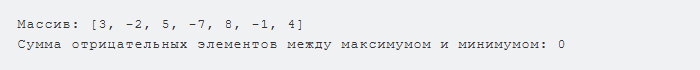

Дан одномерный массив А размерности N. Найти сумму отрицательных элементов, расположенных между максимальным и минимальным.
def sum_negative_between_max_min(A):

    max_idx = A.index(max(A))  # Находим индекс максимального элемента массива
    min_idx = A.index(min(A))  # Находим индекс минимального элемента массива

    # Определяем, какой из индексов меньше, чтобы правильно задать границы диапазона
    start = min(max_idx, min_idx) + 1  # Начинаем с элемента после меньшего индекса
    end = max(max_idx, min_idx)        # Конец диапазона — это больший индекс

    # Проходим по элементам массива в диапазоне между start и end (не включая границы)
    # и суммируем только отрицательные элементы
    negative_sum = sum(x for x in A[start:end] if x < 0)

    return negative_sum  # Возвращаем сумму отрицательных элементов между максимумом и минимумом
Результат примера кода:
