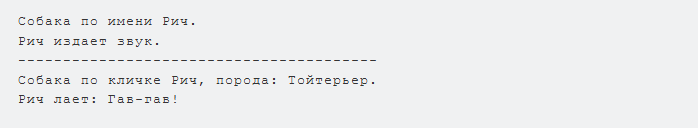

Написать тестовую программу, которая демонстрирует работу методов базового и производного классов.  
Ответом на задачу будет ссылка на репозиторий GitHub, где хранится Ваша программа. Или иным удобным для Вас способом.
    
    class Animal:
    def __init__(self, name: str):
        """
        Конструктор базового класса Animal.
        Принимает имя животного и сохраняет его в атрибуте self.name.
        """
    self.name = name

    def speak(self):
        """
        Метод speak базового класса.
        Возвращает строку с "обычным" звуком животного (обобщённый вариант).
        """
        return f"{self.name} издает звук."

    def info(self):
        """
        Метод info базового класса.
        Возвращает строку с информацией о животном.
        """
        return f"Собака по имени {self.name}."

    class Dog(Animal):
    def __init__(self, name: str, breed: str):
        """
        Конструктор производного класса Dog.
        Вызывает конструктор базового класса через super(),
        а также добавляет новое поле: порода (breed).
        """
    super().__init__(name)  # вызов конструктора Animal
        self.breed = breed

    def speak(self):
        """
        Переопределённый метод speak для класса Dog.
        Возвращает строку, имитирующую лай собаки.
        """
    return f"{self.name} лает: Гав-гав!"

    def info(self):
        """
        Переопределённый метод info для класса Dog.
        Возвращает строку с именем и породой собаки.
        """
        return f"Собака по кличке {self.name}, порода: {self.breed}."

        # Тестовая программа
    if __name__ == "__main__":
        # Создаём объект базового класса Animal
    animal = Animal("Собака")
    print(animal.info())   # вызов метода info из базового класса
    print(animal.speak())  # вызов метода speak из базового класса

    print("-" * 40)  # просто разделитель для наглядности

        # Создаём объект производного класса Dog
    dog = Dog("Рич", "Тойтерьер")
    print(dog.info())   # вызов метода info из класса Dog (переопределённого)
    print(dog.speak())  # вызов метода speak из класса Dog (переопределённого)

Результат примера кода:
