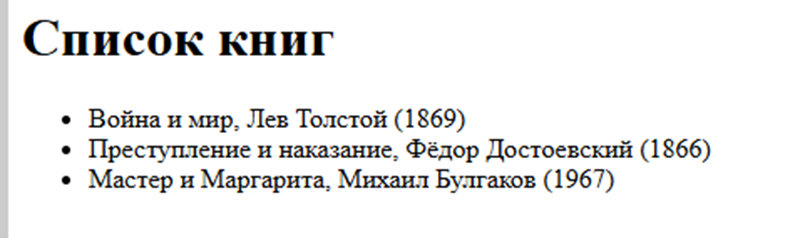

1. Анализ современных WEB-информационных систем

1. Примеры популярных WEB-систем:
   CRM-системы: Salesforce, Bitrix24, amoCRM
   Автоматизация продаж, управление клиентской базой, аналитика.

ERP-системы: SAP, 1C:ERP, Microsoft Dynamics 365
Комплексное управление ресурсами, финансами, производством.

Облачные офисные платформы: Google Workspace, Microsoft 365
Совместная работа, хранение документов, коммуникации.

Интернет-магазины: Shopify, Magento, OpenCart
Электронная коммерция, управление товарами, заказами, клиентами.

Корпоративные порталы: SharePoint, Liferay
Внутренняя коммуникация, обмен документами, базы знаний.

2. Оценка возможностей WEB-приложений
1. Доступность и мобильность
   WEB-приложения доступны из любой точки мира через интернет-браузер, что позволяет сотрудникам работать удалённо и круглосуточно.

2. Масштабируемость
   Такие системы легко масштабируются: можно быстро добавить новых пользователей, расширить функционал или увеличить объём обрабатываемых данных без серьёзных изменений в инфраструктуре.

3. Интеграция
   WEB-приложения поддерживают интеграцию с другими сервисами и программами через API, что позволяет автоматизировать обмен данными между различными системами компании.

4. Безопасность
   Современные WEB-системы реализуют многоуровневую защиту: шифрование данных, аутентификацию, разграничение прав доступа, аудит действий пользователей.

5. Централизованное обновление и поддержка
   Обновления и исправления внедряются на сервере, пользователи всегда работают с актуальной версией системы без необходимости переустановки ПО на своих устройствах.

6. Многопользовательский режим
   WEB-приложения поддерживают одновременную работу большого числа пользователей, что важно для крупных компаний.

7. Облачные решения
   Многие WEB-системы могут быть размещены в облаке, что обеспечивает высокую доступность, отказоустойчивость и снижение затрат на собственную инфраструктуру.

3. Варианты использования WEB-приложений в компании
   Автоматизация бизнес-процессов: управление проектами, документооборот, согласование заявок, контроль задач.
   Работа с клиентами: создание личных кабинетов, онлайн-заявки, поддержка клиентов, CRM-системы.
   Внутренняя коммуникация: корпоративные порталы, чаты, базы знаний, форумы.
   Аналитика и отчётность: сбор, обработка и визуализация данных для принятия управленческих решений.
   Обучение и развитие персонала: платформы для дистанционного обучения, тестирования и сертификации сотрудников.
   Электронная коммерция: интернет-магазины, системы онлайн-оплаты, управление заказами и складом. 

    Решение задачи:
   Проектируем базу данных (MS SQL)
   Создаем базу данных LibraryDB и таблицу Books
   Код:

    `CREATE DATABASE LibraryDB;
    USE LibraryDB;
    CREATE TABLE Books (
    BookID INT IDENTITY(1,1) PRIMARY KEY,
    Title NVARCHAR(200) NOT NULL,
    Author NVARCHAR(100) NOT NULL,
    YearPublished INT
    );

    INSERT INTO Books (Title, Author, YearPublished) VALUES
    ('Война и мир', 'Лев Толстой', 1869),
    ('Преступление и наказание', 'Фёдор Достоевский', 1866),
    ('Мастер и Маргарита', 'Михаил Булгаков', 1967);`

2. Создание Web-приложения в Delphi 12

2.1. Новый проект
Открываем Delphi 12
Создаем новый проект: File → New → Other → Projects → Web → Web Server Application.
Выбираем тип приложения: ISAPI/NSAPI DLL (для IIS).
2.2. Добавление модуля для обработки запросов
В проекте добавляем новый WebModule
На форму WebModule добавляем компонент TADOConnection и заполняем основные параметры в Object

DriverID=MySQL
Server=localhost
Database=librarydb
User_Name=root
Password=Varazol

Проверяем подключение к нашей базе данных LibraryDB

2.3. Добавление обработчика для вывода списка книг
Добавляем компонент TWebActionItem на WebModule.
В событии OnAction пишем код для выборки данных из таблицы Books и вывода их в виде HTML.

Код обработчика:

    procedure TWebModule1.WebModule1DefaultAction(Sender: TObject;
    Request: TWebRequest; Response: TWebResponse; var Handled: Boolean);
    var
    Query: TADOQuery;
    HTML: string;
    begin
    Query := TADOQuery.Create(nil);
    try
    Query.Connection := ADOConnection1;
    Query.SQL.Text := 'SELECT Title, Author, YearPublished FROM Books';
    Query.Open;

    HTML := '<html><head><title>Список книг</title></head><body>';
    HTML := HTML + '<h1>Список книг</h1><ul>';
    while not Query.Eof do
    begin
      HTML := HTML + Format('<li>%s, %s (%d)</li>',
        [Query.FieldByName('Title').AsString,
         Query.FieldByName('Author').AsString,
         Query.FieldByName('YearPublished').AsInteger]);
      Query.Next;
    end;
    HTML := HTML + '</ul></body></html>';
    Response.ContentType := 'text/html; charset=utf-8';
    Response.Content := HTML;
    Handled := True;
    finally
    Query.Free;
    end;
    end;

3. Развертывание на IIS
   Скомпилируем проект — получим DLL-файл.
   Копируем DLL в папку сайта на сервере IIS.
   В IIS:
   Создем новый сайт.
   Указываем путь к DLL.
   Разрешаем ISAPI-расширения.
   Проверяем права доступа к базе данных.

4. Проверка работы
   Открываем браузер и переходим по адресу вашего сайта
   (http://localhost/LibraryWeb/).
   Мы увидим HTML-страницу со списком книг из базы данных
